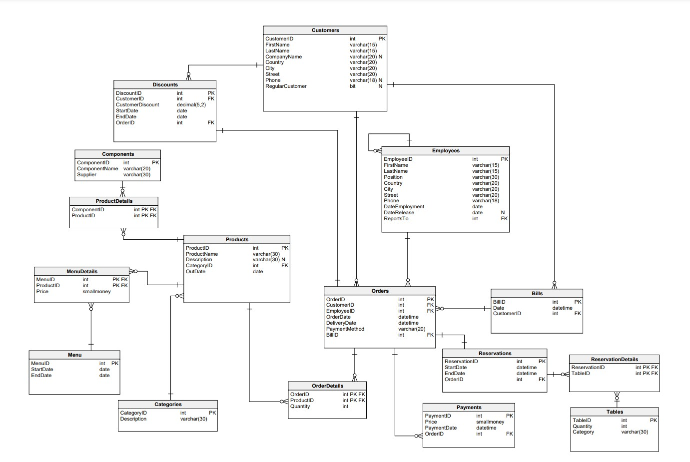

# restaurant-database
AGH UST databases course project

### Project content
* [functionality](functionality.md)
* [tables](tables.md)
* [views](views.md)
* [procedures](procedures.md)
* [functions](functions.md)
* [triggers](triggers.md)
* [indexes](index.md)
* [roles](roles.md)

### Database schema
