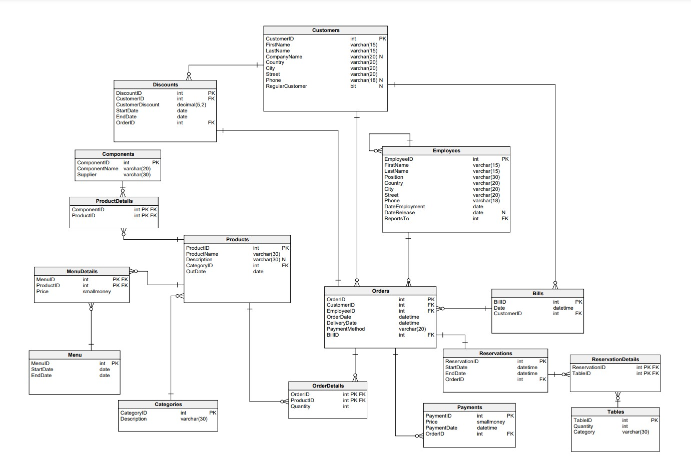

# Funkcjonalność systemu

## Użytkownicy

Klient bez konta:

* wyświetlanie menu
    
    *klient ma możliwość wyświetlenia aktualnie obowiązującego menu*
* utworzenie konta indywidualnego lub firmowego

    *klient ma możliwość utworzenia konta indywidualnego lub firmowego, podając dla każdego przypadku niezbędne informacje. Dodane zostają wpisy do bazy danych w opowiednich tabelach. Od tego momentu klient otrzymuje funkcjonalności odpowiednio wybranego użytkownika systemu*


Klient indywidualny:

* rezerwacja stolika:

     *klient ma możliowść dodania do bazy danych rezerwacji wybranego (wolnego) stolika bądź stolików z datą początku i końca trwania rezerwacji*
* wyświetlanie menu

    *klient ma możliwość pobrania z bazy danych i wyświetlenia aktualnie obowiązującego menu lub menu zaplanowanego na przyszłość*
* składanie zamówienia

    *klient ma możliwość dodania do bazy danych zamówienia z aktualnie obowiązującego menu. Po złożeniu zamówienia, generowany jest rachunek, a wpis dodawany jest do historii zamówień*
* wyświetlanie historii zamówień

    *klient ma możliwość pobrania i wyświetlenia historii swoich zamówień. Ma też możliwość pobrania rachunku dla dowolnie wybranego zamówienia z listy*
* wyświetlenie listy wolnych stolików

    *klient ma możliwość pobrania i wyświetlenia listy wolnych stolików w danym przedziale czasowym*
    

Klient firmowy:
* rezerwacja stolika (indywidualnie bądź na firmę)

    *klient ma możliwość rezerwacji stolika jako klient indywidualny, lub rezerwacji stolika (lub kilku) na wydarzenie firmowe*
* wyświetlanie menu

    *klient ma możliwość pobrania z bazy danych i wyświetlenia aktualnie obowiązującego menu*
* składanie zamówienia (indywidualnie bądź na firmę)

    *klient ma możliwość dodania do bazy danych zamówienia z aktualnie obowiązującego menu, generowany jest rachunek, a wpis dodawany jest do historii zamówień. Klient ma możliwość złożenia zamówienia na firmę z rozliczeniem pod koniec miesiąca, w którym zostało złożone zamówienie*
* wyświetlanie historii zamówień

    *klient ma możliwość pobrania i wyświetlenia historii zamówień firmy. Ma możliwość pobrania rachunku dla dowolnie wybranego zamówienia z listy. Ma również możliwość pobrania rachunku za większą ilość zamówień*
* wyświetlanie listy rachunków

    *klient ma możliwość pobrania i wyświetlenia z bazy danych listy rachunków*

Pracownik:
* wystawianie rachunków

    *pracownik ma możliwość wyświetlenia i pobrania rachunku na wskazane przez klienta zamówienie*
* wyświetlanie listy wolnych/zajętych stolików

    *pracownik ma możliwość wyświetlenia wolnych w danej chwili stolików. Zarezerwowane stoliki nie wyświetlają się na liście wolnych miejsc podany w konfiguracji okres czasu przed wyznaczoną godziną*
* sprawdzanie historii zamówień

    *pracownik ma możliwość wyświetlenia historii zamówień klienta. Dla danego zamówienia pracownik ma możliwość sprawdzenia rachunku, a także wydrukowanie go na prośbę klienta*
* tworzenie zamówienia (przy kasie)

    *pracownik ma możliwość ręcznego stworzenia zamówienia na konto danego klienta. Jeżeli klient nie ma konta, pracownik ma możliwość utworzenia konta w systemie*

Kierownik zmiany:
* Uprawnienia zwykłego pracownika

    *jak wyżej*
* aktualizowanie menu

    *pracownik może zmienić część, bądź całość aktualnie obowiązującego menu, poprzez dodanie nowego wpisu do bazy danych. pracownik może przedłużyć, lub skrócić czas obowiązywania aktualnego menu. Podczas uaktualniania menu, pracownik musi podać datę początku i datę końca obowiązywania nowego menu*

Właściciel:

pełny dostęp do bazy danych, m.in.:
* aktualizowanie listy produktów

    *właściciel ma możliwość dodawania i usuwania listy produktów z bazy danych*
* edycja listy pracowników

    *właściciel może dodawać i usuwać pracowników z listy. Dodanie i usunięcie pracownika z listy polega na odpowiedniej edycji pola odpowiadającego za datę początku i końca pracy wybranego pracownika*
* zmiana uprawnień użytkownika

    *właściciel może zmienić uprawnienia pracownika poprzez edycję wybranego pola w bazie danych*

## System

Podstawowe funkcjonalności systemu:
* wyświetlanie informacji o zamówieniu (podliczanie kosztów, tworzenie rachunku, itp)

    *system automatycznie zbiera potrzebne dane oraz dokonuje niezbędnych obliczeń do wyświetlenia informacji o kosztach, rachunku, itp. tworzenia zamówienia. Pracownicy i klienci mają możliwość pobrania obliczonych informacji*
* sprawdzanie i aktualizowanie listy wolnych miejsc

    *na prośbę pracownika bądź klienta, system pobiera potrzebne informację z bazy danych i na ich podstawie wyświetla listę wolnych miejsc*
* automatyczne aktualizoanie rabatów

    *po spełnieniu określonych warunków, system automatycznie aktualizuje rabaty na koncie klienta. System na życzenie klienta, może wysłać infromacje na wskazany adres kontaktowy o nowym rabacie*
* automatyczne aktualizowanie dostępności stolików

    *system automatycznie sprawdza i aktualizuje listę wolnych stolików*



# Tabele

### Rachunki
```sql
CREATE TABLE Bills (
    BillID int NOT NULL IDENTITY(1,1),
    Date datetime NOT NULL,
    CustomerID int NOT NULL,
    CONSTRAINT Bills_pk PRIMARY KEY (BillID)
);
```

### Kategorie
```sql
CREATE TABLE Categories (
    CategoryID int NOT NULL IDENTITY(1,1),
    Description varchar(30) NOT NULL,
    CONSTRAINT Categories_pk PRIMARY KEY (CategoryID)
);
```

### Składniki
```sql
CREATE TABLE Components (
    ComponentID int NOT NULL IDENTITY(1,1),
    ComponentName varchar(20) NOT NULL,
    Supplier varchar(30) NOT NULL,
    CONSTRAINT Components_pk PRIMARY KEY (ComponentID)
);
```

### Klienci
```sql
CREATE TABLE Customers (
    CustomerID int NOT NULL IDENTITY(1,1),
    FirstName varchar(15) NOT NULL,
    LastName varchar(15) NOT NULL,
    CompanyName varchar(20) NULL DEFAULT NULL,
    Country varchar(20) NOT NULL,
    City varchar(20) NOT NULL,
    Street varchar(20) NOT NULL,
    Phone varchar(18) NULL DEFAULT NULL, --UNIQUE,
    RegularCustomer bit NULL DEFAULT 0,
    CONSTRAINT Customers_pk PRIMARY KEY (CustomerID)
);
```

### Zniżki
```sql
CREATE TABLE Discounts (
    DiscountID int NOT NULL IDENTITY(1,1),
    CustomerID int NOT NULL,
    CustomerDiscount decimal(5,2) NOT NULL,
    StartDate date NOT NULL,
    EndDate date NOT NULL,
    OrderID int NOT NULL,
    CHECK (EndDate > StartDate),
    CONSTRAINT Discounts_pk PRIMARY KEY (DiscountID)
);
```

### Pracownicy
```sql
CREATE TABLE Employees (
    EmployeeID int NOT NULL IDENTITY(1,1),
    FirstName varchar(15) NOT NULL,
    LastName varchar(15) NOT NULL,
    Position varchar(30) NOT NULL DEFAULT 'Employee',
    Country varchar(20) NOT NULL,
    City varchar(20) NOT NULL,
    Street varchar(20) NOT NULL,
    Phone varchar(18) NOT NULL UNIQUE,
    DateEmployment date NOT NULL,
    DateRelease date NULL,
    ReportsTo int NOT NULL,
    CONSTRAINT Employees_pk PRIMARY KEY (EmployeeID)
);
```

### Menu
```sql
CREATE TABLE Menu (
    MenuID int NOT NULL IDENTITY(1,1),
    StartDate date NOT NULL,
    EndDate date NOT NULL,
    CHECK (EndDate > StartDate),
    CONSTRAINT Menu_pk PRIMARY KEY (MenuID)
);
```

### Szczegóły menu
```sql
CREATE TABLE MenuDetails (
    MenuID int NOT NULL,
    ProductID int NOT NULL,
    Price smallmoney NOT NULL,
    CONSTRAINT MenuDetails_pk PRIMARY KEY (MenuID,ProductID)
);
```

### Zamówienia
```sql
CREATE TABLE Orders (
    OrderID int NOT NULL IDENTITY(1,1),
    CustomerID int NOT NULL,
    EmployeeID int NOT NULL,
    OrderDate datetime DEFAULT GETDATE(),
    DeliveryDate datetime default NULL,
    PaymentMethod varchar(20) NOT NULL,
    BillID int,
    CHECK (PaymentMethod in ('Credit Card', 'Debit Card', 'PayPal', 'Cash') AND DeliveryDate >= OrderDate),
    CONSTRAINT Orders_pk PRIMARY KEY (OrderID),
);
```

### Szczegóły zamówień
```sql
CREATE TABLE OrderDetails (
    OrderID int NOT NULL,
    ProductID int NOT NULL,
    Quantity int NOT NULL DEFAULT 1,
    CONSTRAINT OrderDetails_pk PRIMARY KEY (OrderID,ProductID)
);
```

### Dokonane płatności
```sql
CREATE TABLE Payments (
    PaymentID int NOT NULL IDENTITY(1,1),
    Price smallmoney NOT NULL,
    PaymentDate datetime NOT NULL DEFAULT GETDATE(),
    OrderID int NOT NULL,
    CONSTRAINT Payments_pk PRIMARY KEY (PaymentID)
);
```

### Produkty
```sql
CREATE TABLE Products (
    ProductID int NOT NULL IDENTITY(1,1),
    ProductName varchar(30) NOT NULL UNIQUE,
    Description varchar(30) NULL DEFAULT NULL,
    CategoryID int NOT NULL,
    OutDate date NOT NULL,
    CONSTRAINT Products_pk PRIMARY KEY (ProductID)
);
```

### Szczegóły produktu
```sql
CREATE TABLE ProductDetails (
    ComponentID int NOT NULL,
    ProductID int NOT NULL,
    CONSTRAINT ProductDetails_pk PRIMARY KEY (ProductID,ComponentID)
);
```

### Rezerwacje
```sql
CREATE TABLE Reservations (
    ReservationID int NOT NULL IDENTITY(1,1),
    StartDate datetime NOT NULL,
    EndDate datetime NOT NULL,
    OrderID int NOT NULL,
    CHECK (EndDate > StartDate),
    CONSTRAINT Reservations_pk PRIMARY KEY (ReservationID)
);
```

### Szczegóły rezerwacji
```sql
CREATE TABLE ReservationDetails (
    ReservationID int NOT NULL,
    TableID int NOT NULL,
    CONSTRAINT ReservationDetails_pk PRIMARY KEY (TableID,ReservationID)
);
```

### Stoliki
```sql
CREATE TABLE Tables (
    TableID int NOT NULL IDENTITY(1,1),
    Quantity int NOT NULL,
    Category varchar(30) NOT NULL,
    CONSTRAINT Tables_pk PRIMARY KEY (TableID)
);
```

# Widoki

### 1. Aktualne menu
```sql
CREATE VIEW ViewMenu AS
    select ProductName, P.Description DescriptionProducts, C.Description DescriptionCategory, Price
    from Menu
    LEFT JOIN MenuDetails MD ON Menu.MenuID = MD.MenuID
    JOIN Products P ON MD.ProductID = P.ProductID
    JOIN Categories C ON P.CategoryID = C.CategoryID
    WHERE GETDATE() BETWEEN StartDate AND EndDate
```

### 2. Miesięczne wpływy
```sql
CREATE VIEW PaymentMonthlyStats AS
    SELECT YEAR(Date) AS Year, MONTH(Date) AS Month, COUNT(*) AS NumberOfBills, SUM(Price) AS TotalAmount
    FROM Bills
    JOIN Orders O ON Bills.BillID = O.BillID
    JOIN Payments P ON O.OrderID = P.OrderID
    GROUP BY YEAR(DATE), MONTH(Date)
```

### 3. Miesięczna liczba rezerwacji i miesięczna liczba zarezerwowanych stolików
```sql
CREATE VIEW MonthlyTableReservationReport AS
    SELECT YEAR(StartDate) AS Year, DATENAME(MONTH,StartDate) AS Month, COUNT(*) AS NumberOfReservations,
           SUM(Quantity) AS TotalTablesReserved
    FROM Reservations
    JOIN ReservationDetails ON Reservations.ReservationID = ReservationDetails.ReservationID
    JOIN Tables T ON ReservationDetails.TableID = T.TableID
    GROUP BY DATENAME(MONTH,StartDate ), YEAR(StartDate);
```

### 4. Tygodniowa liczba rezerwacji i tygodniowa liczba zarezerwowanych stolików
```sql
CREATE VIEW WeeklyTableReservationReport AS
    SELECT  DATENAME(weekday, StartDate) AS Day, COUNT(*) AS NumberOfReservations,
           SUM(Quantity) AS TotalTablesReserved
    FROM Reservations
    JOIN ReservationDetails ON Reservations.ReservationID = ReservationDetails.ReservationID
    JOIN Tables T ON ReservationDetails.TableID = T.TableID
    GROUP BY DATEPART(weekday, StartDate), DATENAME(weekday, StartDate)
```

### 5. Wartość rabatu dla klienta
```sql
CREATE VIEW CustomerDiscounts AS
    SELECT DISTINCT Customers.CustomerID, Customers.FirstName, Customers.LastName,
            Discounts.CustomerDiscount, Discounts.EndDate
    FROM Customers
    LEFT JOIN Discounts ON Customers.CustomerID = Discounts.CustomerID
```

### 6. Opis produktu i lista składników
```sql
CREATE VIEW ProductsComponents AS
    SELECT p.ProductName, p.Description ProductDescription, c.Description CategoryDescription, STRING_AGG(C2.ComponentName, ',') Components
    from Products p
    JOIN Categories C ON P.CategoryID = C.CategoryID
    JOIN ProductDetails PD ON p.ProductID = PD.ProductID
    JOIN Components C2 ON PD.ComponentID = C2.ComponentID
    GROUP BY  p.ProductName, p.Description, c.Description
```

### 7. Statystyki zamówień dla każdego klienta
```sql
CREATE VIEW CustomersStats AS
    SELECT
        Customers.CustomerId, Customers.FirstName, Customers.LastName,Customers.CompanyName, SUM(P.Price) AS TotalAmount,
        COUNT(*) AS NumberOfOrders, MIN(Orders.OrderDate) AS FirstOrderDate,
        MAX(Orders.OrderDate) AS LastOrderDate,
        SUM(MD.Price) OrderPrice
    FROM Customers
    JOIN Orders ON Customers.CustomerID = Orders.CustomerID
    JOIN Payments P ON Orders.OrderID = P.OrderID
    JOIN OrderDetails OD ON Orders.OrderID = OD.OrderID
    JOIN Products P2 ON OD.ProductID = P2.ProductID
    JOIN MenuDetails MD ON OD.ProductID = MD.ProductID
    GROUP BY Customers.CustomerID, Customers.FirstName, Customers.LastName, Customers.CompanyName
```

# Procedury

### 1. Dodawanie nowego zamówienia
```sql
CREATE PROCEDURE AddOrder(
    @customerID INT,
    @employeeID INT,
    @paymentMethod VARCHAR(20),
    @deliveryDate DATETIME = NULL)
AS
BEGIN
    BEGIN TRY
        IF @deliveryDate IS NULL
            BEGIN
                SET @deliveryDate = DATEADD(HOUR, 1, GETDATE())
            END
        IF NOT EXISTS(SELECT * FROM Customers WHERE CustomerID = @customerID)
            BEGIN
                THROW 52000, N'Unknown customer!', 1;
            END
        IF NOT EXISTS(SELECT * FROM Employees WHERE EmployeeID = @employeeID)
            BEGIN
                THROW 52000, N'Unknown employee!', 1;
            END

        INSERT INTO Orders(CustomerID, EmployeeID, OrderDate, DeliveryDate, PaymentMethod)
        VALUES (@customerID, @employeeID, GETDATE(), @deliveryDate, @paymentMethod)
    END TRY
    BEGIN CATCH
        DECLARE @msg NVARCHAR(2048) = N'ERROR: ' + ERROR_MESSAGE();
        THROW 52000, @msg, 1;
    END CATCH
END
```

### 2. Dodawanie menu
```sql
CREATE PROCEDURE AddMenu(
    @StartDate DATE,
    @EndDate DATE
)
AS
BEGIN
    BEGIN TRY
        IF ((SELECT COUNT(*)
             FROM Menu
             WHERE (@StartDate BETWEEN StartDate AND EndDate)
                OR (@EndDate BETWEEN StartDate AND EndDate)) > 0)
            BEGIN
                THROW 50002, N'There is applicable menu, can not add new one!', 1
            END

        INSERT INTO Menu (StartDate, EndDate)
        VALUES (@StartDate, @EndDate)
    END TRY
    BEGIN CATCH
        DECLARE @Message NVARCHAR(1000) = N'ERROR: ' + ERROR_MESSAGE();
        THROW 50002, @Message, 1;
    END CATCH
END
```

### 3. Dodawanie szczegółów zamówienia
```sql
CREATE PROCEDURE AddOrderDetail(
    @orderID INT,
    @productID INT,
    @quantity INT)
AS
BEGIN
    DECLARE @DeliveryDate DATE
    SET @DeliveryDate = (SELECT DeliveryDate
                         FROM Orders
                         WHERE OrderID = @orderID)

    BEGIN TRY
        IF NOT EXISTS(SELECT P.productID
                      FROM Menu
                               LEFT JOIN MenuDetails MD ON Menu.MenuID = MD.MenuID
                               JOIN Products P ON MD.ProductID = P.ProductID
                      WHERE @DeliveryDate BETWEEN StartDate AND EndDate
                        AND @productID = P.ProductID)
            BEGIN
                THROW 50051, N'There is no menu for the given week!', 1;
            END

        IF (SELECT dbo.SeaFood(@productID)) = 1 AND (SELECT dbo.EarlyOrderSeaFood(@OrderID)) = 0
            BEGIN
                THROW 50051, N'Can not place an order for sea food for that day!', 1;
            END

        IF (@quantity < 1)
            BEGIN
                THROW 50051, N'products amount must be positive!', 1;
            END
        IF EXISTS(
                SELECT * FROM OrderDetails OD WHERE OD.OrderID = @orderID AND OD.ProductID = @productID
            )
            BEGIN
                UPDATE OrderDetails
                SET Quantity = Quantity + @quantity
                WHERE ProductID = @productID
            END

        INSERT INTO OrderDetails (OrderID, ProductID, Quantity)
        VALUES (@orderID, @productID, @quantity)
    END TRY
    BEGIN CATCH
        DECLARE @msg NVARCHAR(2048) = N'ERROR: ' + ERROR_MESSAGE();
        THROW 50051, @msg, 1;
    END CATCH
END
```

### 4. Dodawanie nowego klienta
```sql
CREATE PROCEDURE AddCustomer(
    @FirstName VARCHAR(15),
    @LastName VARCHAR(15),
    @CompanyName VARCHAR(20) = NULL,
    @Country VARCHAR(20),
    @City VARCHAR(20),
    @Street VARCHAR(20),
    @Phone VARCHAR(18) = NULL,
    @RegularCustomer INT = 1
)
AS
BEGIN
    INSERT INTO Customers (FirstName, LastName, CompanyName, Country, City, Street, Phone, RegularCustomer)
    VALUES (@FirstName, @LastName, @CompanyName, @Country, @City, @Street, @Phone, @RegularCustomer)
END
```

### 5. Aktualizowanie daty dostarczenia zamówienia
```sql
CREATE PROCEDURE AddDeliveryDate(@orderID INT)
AS
BEGIN
    BEGIN TRY
        IF NOT EXISTS(
                SELECT * FROM Orders WHERE OrderID = @orderID
            )
            BEGIN
                THROW 50053, N'Order do not exits', 1;
            END
        ELSE
            BEGIN
                UPDATE Orders
                SET DeliveryDate = GETDATE()
                WHERE OrderID = @orderID
            END
    END TRY
    BEGIN CATCH
        DECLARE @msg NVARCHAR(2048) = N'ERROR: ' + ERROR_MESSAGE();
        THROW 50053, @msg, 1;
    END CATCH
END
```

### 6. Wyświetlanie informacji o pracowniku
```sql
CREATE PROCEDURE EmployeeInfo(@employeeID INT)
AS
BEGIN
    BEGIN TRY
        IF NOT EXISTS(
                SELECT *
                FROM Employees
                WHERE @employeeID = EmployeeID
            )
            BEGIN
                THROW 52000, N'There is no employee with given ID', 1
            END
        SELECT FirstName,
               LastName,
               Position,
               ReportsTo,
               Country,
               City,
               Street,
               Phone,
               DateEmployment,
               DateRelease
        FROM Employees
        WHERE EmployeeID = @employeeID
    END TRY
    BEGIN CATCH
        DECLARE @msg NVARCHAR(2048) = N'ERROR: ' + ERROR_MESSAGE();
        THROW 52000, @msg, 1;
    END CATCH
END
```

### 7. Wyświetlanie informacji o kliencie
```sql
CREATE PROCEDURE CustomerInfo(@customerID INT)
AS
BEGIN
    BEGIN TRY
        IF NOT EXISTS(
                SELECT *
                FROM Customers
                WHERE @customerID = CustomerID
            )
            BEGIN
                THROW 52000, N'There is no customer with given ID', 1
            END
        SELECT FirstName,
               LastName,
               CompanyName,
               Country,
               City,
               Street,
               Phone,
               RegularCustomer
        FROM Customers
        WHERE CustomerID = @customerID
    END TRY
    BEGIN CATCH
        DECLARE @msg NVARCHAR(2048) = N'ERROR: ' + ERROR_MESSAGE();
        THROW 52000, @msg, 1;
    END CATCH
END
```

### 8. Wyświetlanie informacji o danym produkcie
```sql
CREATE PROCEDURE ProductInfo(@productID INT)
AS
BEGIN
    BEGIN TRY
        IF NOT EXISTS(
                SELECT *
                FROM Products
                WHERE ProductID = @productID
            )
            BEGIN
                THROW 52000, N'There is no product with given ID', 1
            END
        SELECT P.ProductName,
               P.Description                     "Product Description",
               Cat.Description                   "Category Description",
               STRING_AGG(C.ComponentName, ', ') Components
        FROM Products P
                 JOIN Categories Cat ON P.CategoryID = Cat.CategoryID
                 JOIN ProductDetails PD ON P.ProductID = PD.ProductID
                 JOIN Components C ON PD.ComponentID = C.ComponentID
        WHERE P.ProductID = @productID
        GROUP BY P.ProductName, P.Description, Cat.Description
    END TRY
    BEGIN CATCH
        DECLARE @msg NVARCHAR(2048) = N'ERROR: ' + ERROR_MESSAGE();
        THROW 52000, @msg, 1;
    END CATCH
END
```

### 9. Wyświetlanie rachunku za zamówienie
```sql
CREATE PROCEDURE GetBill(@orderID INT)
AS
BEGIN
    BEGIN TRY
        IF NOT EXISTS(
                SELECT *
                FROM Orders
                WHERE OrderID = @orderID
            )
            BEGIN
                THROW 52000, N'There is no order with given ID', 1;
            END
        IF NOT EXISTS(
                SELECT *
                FROM Bills
                         JOIN Orders O ON Bills.BillID = O.BillID
                WHERE O.OrderID = @orderID
            )
            BEGIN
                THROW 52000, N'Order does not have generated bill', 1;
            END
        SELECT C.CustomerID, C.FirstName, C.LastName, B.Date "Billing date", dbo.OrderPrice(@orderID) "Order Price"
        FROM Bills B
                 JOIN Customers C ON B.CustomerID = C.CustomerID
                 JOIN Orders O ON B.BillID = O.BillID
        WHERE O.OrderID = @orderID
    END TRY
    BEGIN CATCH
        DECLARE @msg NVARCHAR(2048) = N'ERROR: ' + ERROR_MESSAGE();
        THROW 52000, @msg, 1;
    END CATCH
END
```

### 10. Usuwanie klienta z bazy danych
```sql
CREATE PROCEDURE DeleteCustomer(@customerID INT)
AS
BEGIN
    BEGIN TRY
        IF NOT EXISTS(
                SELECT *
                FROM Customers
                WHERE CustomerID = @customerID
            )
            BEGIN
                THROW 52000, N'There is no customer with given ID', 1;
            END
        DECLARE @an NVARCHAR(10) = 'xxxxxxxx'
        UPDATE Customers
        SET FirstName   = @an,
            LastName    = @an,
            CompanyName = @an,
            Country     = @an,
            City        = @an,
            Street      = @an,
            Phone       = @an
        WHERE CustomerID = @customerID
    END TRY
    BEGIN CATCH
        DECLARE @msg NVARCHAR(2048) = N'ERROR: ' + ERROR_MESSAGE();
        THROW 52000, @msg, 1;
    END CATCH
END
```

### 11. Dodawanie stolika do rezerwacji
```sql
CREATE PROCEDURE AddTableToReservation(@reservationID INT, @tableID INT)
AS
BEGIN
    BEGIN TRY
        IF NOT EXISTS(
                SELECT *
                FROM Reservations
                WHERE ReservationID = @reservationID
            )
            BEGIN
                THROW 52000, N'There is no table with given ID', 1;
            END

        DECLARE @startDate DATETIME
        DECLARE @endDate DATETIME
        SELECT @startDate = StartDate, @endDate = EndDate FROM Reservations WHERE ReservationID = @reservationiD
        IF EXISTS(
                SELECT *
                FROM ReservationDetails
                         JOIN Reservations R ON ReservationDetails.ReservationID = R.ReservationID
                WHERE StartDate <= @endDate
                  AND EndDate >= @startDate
                  AND TableID = @tableID
            )
            BEGIN
                THROW 52000, N'Unavailable table', 1;
            END

        INSERT INTO ReservationDetails
        VALUES (@reservationID, @tableID)
    END TRY
    BEGIN CATCH
        DECLARE @msg NVARCHAR(2048) = N'ERROR: ' + ERROR_MESSAGE();
        THROW 52000, @msg, 1;
    END CATCH
END
```

### 12. Dodawanie nowej rezerwacji
```sql
CREATE PROCEDURE AddReservation(
    @startDate DATETIME,
    @endDate DATETIME,
    @orderID INT,
    @tableID INT
)
AS
BEGIN
    BEGIN TRY
        IF EXISTS(
                SELECT *
                FROM Reservations
                WHERE OrderID = @orderID
            )
            BEGIN
                THROW 52000, N'Reservation already exists', 1;
            END
        DECLARE @customerID INT = (SELECT Customers.CustomerID
                                   FROM Customers
                                            JOIN Orders O ON Customers.CustomerID = O.CustomerID
                                   WHERE OrderID = @orderID)
        DECLARE @regular BIT = (SELECT RegularCustomer
                                FROM Customers
                                WHERE CustomerID = @customerID)
        IF (@regular = 0)
            BEGIN
                THROW 52000, N'To make reservation you have to be regular customer', 1;
            END
        IF ((SELECT dbo.OrderPrice(@orderID)) < 50 OR (SELECT dbo.OrderPrice(@orderID)) IS NULL)
            BEGIN
                THROW 52000, N'Order price has to be at least 50', 1;
            END

        INSERT INTO Reservations (StartDate, EndDate, OrderID)
        VALUES (@startDate, @endDate, @orderID)

        DECLARE @newID INT = (SELECT ReservationID
                              FROM Reservations
                              WHERE OrderID = @orderID AND StartDate = @startDate AND EndDate = @endDate)

        EXEC AddTableToReservation @newID, @tableID
    END TRY
    BEGIN CATCH
        DECLARE @msg NVARCHAR(2048) = N'ERROR: ' + ERROR_MESSAGE();
        THROW 52000, @msg, 1;
    END CATCH
END
```

### 13. Generowanie rachunku
```sql
CREATE PROCEDURE GenerateBill(@orderID INT)
AS
BEGIN
    BEGIN TRY
        IF ((SELECT BillID FROM Orders WHERE OrderID = @orderID) IS NOT NULL)
            BEGIN
                THROW 52000, N'Bill already exits', 1;
            END

        DECLARE @orderPrice SMALLMONEY = dbo.OrderPrice(@orderID)
        DECLARE @paymentSum SMALLMONEY = dbo.PaymentsSum(@orderID)
        IF (@orderPrice > @paymentSum OR @orderPrice IS NULL OR @paymentSum IS NULL)
            BEGIN
                THROW 52000, N'Payments have not been settled', 1;
            END

        DECLARE @currDate DATETIME = GETDATE()
        DECLARE @customerID INT = (SELECT CustomerID FROM Orders WHERE OrderID = @orderID)
        INSERT INTO Bills(Date, CustomerID)
        VALUES (@currDate, @customerID)

        DECLARE @billID INT = (SELECT BillID FROM Bills WHERE Date = @currDate AND CustomerID = @customerID)
        UPDATE Orders
        SET BillID = @billID
        WHERE OrderID = @orderID
    END TRY
    BEGIN CATCH
        DECLARE @msg NVARCHAR(2048) = N'ERROR: ' + ERROR_MESSAGE();
        THROW 52000, @msg, 1;
    END CATCH
END
```

### 14. Dodawanie płatności
```sql
CREATE PROCEDURE AddPayment(@orderID INT, @price SMALLMONEY)
AS
BEGIN
    INSERT INTO Payments(Price, PaymentDate, OrderID)
    VALUES (@price, GETDATE(), @orderID)
END
```

### 15. Dodawanie nowego produktu
```sql
CREATE PROCEDURE AddNewProduct(@productName VARCHAR(30), @productDescription VARCHAR(30), @categoryID INT, @outDate DATE = NULL)
AS
BEGIN
    BEGIN TRY
        IF EXISTS(
                SELECT *
                FROM Products
                WHERE ProductName = @productName
                  AND Description = @productDescription
                  AND CategoryID = @categoryID
            )
            BEGIN
                THROW 52000, N'Product already exits on products list', 1;
            END

        INSERT INTO Products(ProductName, Description, CategoryID, OutDate)
        VALUES (@productName, @productDescription, @categoryID, @outDate)
    END TRY
    BEGIN CATCH
        DECLARE @msg NVARCHAR(2048) = N'ERROR: ' + ERROR_MESSAGE();
        THROW 52000, @msg, 1;
    END CATCH
END
```

### 16. Dodawanie składników produktu
```sql
CREATE PROCEDURE AddProductComponent(@productID INT, @componentID INT)
AS
BEGIN
    BEGIN TRY
        IF EXISTS(
                SELECT *
                FROM ProductDetails
                WHERE ProductID = @productID
                  AND ComponentID = @componentID
            )
            BEGIN
                THROW 52000, N'Component already exits on product components list', 1;
            END
        INSERT INTO ProductDetails(ComponentID, ProductID)
        VALUES (@componentID, @productID)
    END TRY
    BEGIN CATCH
        DECLARE @msg NVARCHAR(2048) = N'ERROR: ' + ERROR_MESSAGE();
        THROW 52000, @msg, 1;
    END CATCH
END
```

### 17. Dodawanie nowego składnika
``` sql
CREATE PROCEDURE AddNewComponent(@componentName VARCHAR(30), @supplier VARCHAR(30))
AS
BEGIN
    BEGIN TRY
        IF EXISTS(
                SELECT *
                FROM Components
                WHERE ComponentName = @componentName
                  AND Supplier = @supplier
            )
            BEGIN
                THROW 52000, N'Component already exits on components list', 1;
            END

        INSERT INTO Components(ComponentName, Supplier)
        VALUES (@componentName, @supplier)
    END TRY
    BEGIN CATCH
        DECLARE @msg NVARCHAR(2048) = N'ERROR: ' + ERROR_MESSAGE();
        THROW 52000, @msg, 1;
    END CATCH
END
```

### 18. Dodawanie produktu do menu
```sql
CREATE PROCEDURE AddProductToMenu(
    @ProductID INT,
    @MenuID INT,
    @Price SMALLMONEY
)
AS
BEGIN
    DECLARE @StartMenuDate DATE
    DECLARE @EndMenuDate DATE
    DECLARE @tmp DATE
    SELECT @StartMenuDate = StartDate, @EndMenuDate = EndDate FROM Menu WHERE MenuID = @MenuID
    SET @tmp = @StartMenuDate
    BEGIN TRY
        IF ((SELECT COUNT(*) FROM MenuDetails WHERE MenuID = @MenuID AND ProductID = @ProductID) = 0)
            BEGIN
                INSERT INTO MenuDetails(menuid, productid, price)
                VALUES (@MenuID, @ProductID, @Price)
                WHILE @tmp <= @EndMenuDate
                    BEGIN
                        IF (SELECT dbo.CheckMenu(@tmp)) = 0
                            BEGIN
                                DELETE
                                FROM MenuDetails
                                WHERE MenuID = @MenuID AND ProductID = @productID AND Price = @Price;
                                THROW 50003, N'Can not add this product, 50% dishes rule', 1
                            END
                        SET @tmp = DATEADD(DAY, 1, @tmp)
                    END
            END
        ELSE
            BEGIN
                THROW 50003, N'Product is in this Menu', 1
            END
    END TRY
    BEGIN CATCH
        DECLARE @Message NVARCHAR(1000) = N'ERROR: ' + ERROR_MESSAGE();
        THROW 50003, @Message, 1;
    END CATCH
END
```

### 19. Przedłużenie rezerwacji
```sql
CREATE PROCEDURE ExtendReservation(
    @ReservationID INT,
    @NewEndTime DATETIME
)
AS
BEGIN
    DECLARE @OldEndTIME DATETIME
    SET @OldEndTime = (SELECT EndDate FROM Reservations WHERE @ReservationID = ReservationID)
    BEGIN TRY
        IF ((SELECT COUNT(*)
             FROM Tables
                      JOIN ReservationDetails RD ON Tables.TableID = RD.TableID
                      JOIN Reservations R3 ON RD.ReservationID = R3.ReservationID
             WHERE StartDate BETWEEN @OldEndTIME AND @NewEndTime
               AND Tables.tableId IN (SELECT tables.tableid
                                      FROM tables
                                               JOIN ReservationDetails RD ON Tables.TableID = RD.TableID
                                      WHERE ReservationID = @ReservationID)) = 0)
            BEGIN
                UPDATE Reservations SET EndDate = @NewEndTime WHERE ReservationID = @ReservationID
            END
        ELSE
            THROW 50004, N'Table is occupied', 1
    END TRY
    BEGIN CATCH
        DECLARE @Message NVARCHAR(1000) = N'ERROR: ' + ERROR_MESSAGE();
        THROW 50004, @Message, 1;
    END CATCH
END
```

### 20. Anulowanie zamówienia
```sql
CREATE PROCEDURE OrderCancellation(
    @OrderID INT
)
AS
BEGIN
    BEGIN TRY
        IF ((SELECT COUNT(*) FROM Orders WHERE OrderID = @OrderID) = 0)
            BEGIN
                THROW 50333, N'There is no such order', 1
            END
        ELSE
            BEGIN
                UPDATE Orders SET OrderDate = NULL WHERE OrderID = @OrderID
            END
    END TRY
    BEGIN CATCH
        DECLARE @Message NVARCHAR(1000) = N'error: ' + ERROR_MESSAGE();
        THROW 50333, @Message, 1;
    END CATCH
END
```

### 21. Dodawanie płatności za zamówienie
```sql
CREATE PROCEDURE AddPayment(@orderID INT, @price SMALLMONEY)
AS
BEGIN
    INSERT INTO Payments(Price, PaymentDate, OrderID)
    VALUES (@price, GETDATE(), @orderID)
END
```

# Funkcje

### 1. Sprawdzanie czy menu jest wymieniane co dwa tygodnie
```sql
CREATE FUNCTION CheckMenu(@CheckDate DATE)
    RETURNS INT
AS
BEGIN
    DECLARE @PreviousMenuID INT
    DECLARE @SameProducts INT
    DECLARE @NextMenuID INT
    DECLARE @MenuLength INT

    SET @PreviousMenuID = (SELECT DISTINCT MenuID FROM MenuForADay(DATEADD(DAY, -14, @CheckDate)))
    SET @NextMenuID = (SELECT DISTINCT MenuID FROM MenuForADay(@CheckDate))
    SET @SameProducts = (SELECT COUNT(*)
                         FROM (SELECT ProductID
                               FROM MenuDetails
                               WHERE MenuID = @NextMenuID
                               INTERSECT
                               SELECT ProductID
                               FROM MenuDetails
                               WHERE MenuID = @PreviousMenuID) OUT)
    SET @MenuLength = (SELECT COUNT(*) FROM MenuDetails WHERE MenuID = (@PreviousMenuID)) / 2
    IF @SameProducts <= @MenuLength
        BEGIN
            RETURN 1
        END
    RETURN 0
END
```

###  2. Sprawdzanie wolnych stolików
```sql
CREATE FUNCTION CheckFreeTables(@StartDate DATETIME, @EndDate DATETIME)
    RETURNS TABLE
        AS
        RETURN
        SELECT TableID, Quantity, Category
        FROM Tables
        EXCEPT
        SELECT T.TableID, T.Quantity, T.Category
        FROM Reservations
                 JOIN ReservationDetails RD ON Reservations.ReservationID = RD.ReservationID
                 JOIN Reservations R2 ON RD.ReservationID = R2.ReservationID
                 JOIN Tables T ON RD.TableID = T.TableID
        WHERE (@StartDate BETWEEN R2.StartDate AND R2.EndDate)
           OR (@EndDate BETWEEN R2.StartDate AND R2.EndDate)
```

### 3. Sprawdzanie zniżki dla klienta
```sql
CREATE FUNCTION GetDiscounts(@customerID INT, @regularClientDiscount DECIMAL(3, 2), @timeDiscount DECIMAL(3, 2))
    RETURNS DECIMAL(3, 2)
AS
BEGIN
    DECLARE @discount DECIMAL(3, 2)
    SET @discount = 0

    IF ((SELECT RegularCustomer FROM Customers WHERE CustomerID = @customerID) = 1)
        BEGIN
            SET @discount += @regularClientDiscount
        END

    IF ((SELECT DiscountID FROM Discounts WHERE GETDATE() BETWEEN StartDate AND EndDate) IS NOT NULL)
        BEGIN
            SET @discount += @timeDiscount
        END
    RETURN @discount
END
```

### Sprawdzanie menu na konkretny dzień
```sql
CREATE FUNCTION MenuForADay(@day DATE)
    RETURNS TABLE
        AS
        RETURN
        SELECT M.MenuID, p.productID, p.ProductName, p.Description ProductsDesc, c.Description CategoryDesc, Price
        FROM Menu AS m
                 JOIN MenuDetails AS d ON m.MenuID = d.MenuID
                 JOIN Products AS p ON d.ProductID = p.ProductID
                 JOIN Categories AS c ON c.CategoryID = p.CategoryID
        WHERE @day <= m.EndDate
          AND @day >= m.StartDate
```

### 5. Cena za zamówienie
```sql
CREATE FUNCTION OrderPrice(@orderID INT)
    RETURNS SMALLMONEY
AS
BEGIN
    DECLARE @result SMALLMONEY
    SET @result = (SELECT SUM(OD.Quantity * MD.Price) AS Price
                   FROM Orders AS O
                            JOIN OrderDetails OD ON O.OrderID = OD.OrderID
                            JOIN Products PD ON OD.ProductID = PD.ProductID
                            JOIN MenuDetails MD ON OD.ProductID = MD.ProductID
                            JOIN Menu M ON MD.MenuID = M.MenuID
                   WHERE O.DeliveryDate >= M.StartDate
                     AND O.DeliveryDate <= M.EndDate
                     AND O.OrderID = @OrderID)
    IF (SELECT COUNT(CustomerDiscount) FROM Discounts WHERE OrderID = @orderID) > 0
        BEGIN
            SET @result = (@result * (100 - (SELECT TOP 1 CustomerDiscount FROM Discounts WHERE OrderID = @orderID))) /
                          100
        END
    ELSE
        IF (SELECT RegularCustomer
            FROM Customers
                     JOIN Orders o ON o.CustomerID = Customers.CustomerID
            WHERE OrderID = @orderID) = 1
            BEGIN
                SET @result = 0.95 * @result
            END
    RETURN @result
END
```

### Suma płatności za zamówienie
```sql
CREATE FUNCTION PaymentsSum(@orderID INT)
    RETURNS SMALLMONEY
AS
BEGIN
    DECLARE @result SMALLMONEY
    SET @result = (SELECT SUM(Price)
                   FROM Payments
                   WHERE OrderID = @orderID)
    RETURN @result
END
```

# Triggery

### 1. Trigger ustawiający końcową datę promocji 7 dni od złożonego zamówienia
```sql
CREATE TRIGGER tr_UpdateDiscountEndDate
ON OrderDetails
AFTER INSERT, UPDATE
AS
BEGIN
    SET NOCOUNT ON;
    DECLARE @OrderID INT;
    DECLARE @StartDate DATE;
    DECLARE @EndDate DATE;
    DECLARE @CustomerID INT;
    SELECT @OrderID = OrderID FROM inserted;
    DECLARE @TotalAmount SMALLMONEY;
    SET @CustomerID =(SELECT CustomerID FROM Orders WHERE OrderID=@OrderID)
    DECLARE @OldDiscount INT;
    DECLARE @NewDiscount INT;
    SELECT @TotalAmount=sum(dbo.OrderPrice(o.OrderID)), @CustomerID=CustomerID FROM Orders o
        WHERE CustomerID =@CustomerID
        GROUP BY CustomerID
    SELECT @OldDiscount= COUNT(*) FROM Discounts
        WHERE  @CustomerID=CustomerID
    SET @NewDiscount = FLOOR(@TotalAmount/1000) - @OldDiscount
    DECLARE @cnt INT = 0;
    WHILE @cnt < @NewDiscount
        BEGIN
            SET @StartDate = Getdate();
            SET @EndDate = DATEADD(DAY, 7, GETDATE());
            INSERT INTO Discounts(CUSTOMERID, CUSTOMERDISCOUNT, STARTDATE, ENDDATE, ORDERID )
            VALUES (@customerID, 5, @StartDate, @EndDate, @OrderID)
            SET @cnt = @cnt +1;
        END
END
```

### 2. Trigger przypisujący stałą zniżkę, jeśli klient ma 10 lub więcej zamówień w restauracji
```sql
CREATE TRIGGER tr_UpdateRegularCustomer
ON Orders
AFTER INSERT
AS
BEGIN
    SET NOCOUNT ON;
    DECLARE @CustomerID INT;
    SELECT @CustomerID = CustomerID FROM inserted;
    UPDATE Customers
    SET RegularCustomer = 1
    WHERE CustomerID = @CustomerID AND
        (SELECT COUNT(*) FROM Orders WHERE CustomerID = @CustomerID) >= 10;
END
```

# Indeksy

```sql
-- customer id
CREATE UNIQUE INDEX Customers_pk
ON Customers (CustomerID)

-- order id
CREATE UNIQUE INDEX Orders_pk
ON Orders (OrderID)

-- reservation id
CREATE UNIQUE INDEX Reservation_pk
ON Reservations (ReservationID)

-- table id
CREATE UNIQUE INDEX Tables_pk
ON Tables (TableID)

-- menu id
CREATE UNIQUE INDEX Menu_pk
ON Menu (MenuID)

-- discount id
CREATE UNIQUE INDEX Discount_pk
ON Discounts (DiscountID)

-- employee id
CREATE UNIQUE INDEX Employee_pk
ON Employees (EmployeeID)

-- bill id
CREATE UNIQUE INDEX Bill_pk
ON Bills (BillID)

-- payment id
CREATE UNIQUE INDEX Payment_pk
ON Payments (PaymentID)

-- product id
CREATE UNIQUE INDEX Product_pk
ON Products (ProductID)

-- component id
CREATE UNIQUE INDEX Component_pk
ON Components (ComponentID)

-- category id
CREATE UNIQUE INDEX Category_pk
ON Categories (CategoryID)

-- menu date
CREATE UNIQUE INDEX Menu_date
ON Menu (StartDate, EndDate)

-- order date
CREATE UNIQUE INDEX Orders_Date
ON Orders (OrderDate, DeliveryDate)
```

# Uprawnienia

### Admin
```sql
CREATE ROLE admin
GRANT ALL PRIVILEGES ON u_justyna.dbo to admin
```

### Moderator
```sql
CREATE ROLE moderator

GRANT EXECUTE ON AddProductToMenu to moderator
GRANT EXECUTE ON DeleteCustomer to moderator
GRANT EXECUTE ON EmployeeInfo to moderator
GRANT EXECUTE ON GetDiscounts to moderator

-- worker privileges
GRANT EXECUTE ON AddCustomer to moderator
GRANT EXECUTE ON AddDeliveryDate to moderator
GRANT EXECUTE ON AddOrder to moderator
GRANT EXECUTE ON AddOrderDetail to moderator
GRANT EXECUTE ON AddOrderWithReservation to moderator
GRANT EXECUTE ON AddPayment to moderator
GRANT EXECUTE ON AddReservation to moderator
GRANT EXECUTE ON AddTableToReservation to moderator
GRANT SELECT ON CheckFreeTables to moderator
GRANT SELECT ON MenuForADay to moderator
GRANT EXECUTE ON CheckMenu to moderator
GRANT EXECUTE ON OrderPrice to moderator
GRANT EXECUTE ON PaymentsSum to moderator
GRANT EXECUTE ON CustomerInfo to moderator
GRANT EXECUTE ON ExtendReservation to moderator
GRANT EXECUTE ON GenerateBill to moderator
GRANT EXECUTE ON GetBill to moderator
GRANT EXECUTE ON OrderCancellation to moderator
GRANT EXECUTE ON ProductInfo to moderator
GRANT EXECUTE ON UpdateDeliveryDate to moderator
```

### Pracownik
```sql
CREATE ROLE worker

GRANT EXECUTE ON AddCustomer to worker
GRANT EXECUTE ON AddDeliveryDate to worker
GRANT EXECUTE ON AddOrder to worker
GRANT EXECUTE ON AddOrderDetail to worker
GRANT EXECUTE ON AddOrderWithReservation to worker
GRANT EXECUTE ON AddPayment to worker
GRANT EXECUTE ON AddReservation to worker
GRANT EXECUTE ON AddTableToReservation to worker
GRANT SELECT ON CheckFreeTables to worker
GRANT SELECT ON MenuForADay to worker
GRANT EXECUTE ON CheckMenu to worker
GRANT EXECUTE ON OrderPrice to worker
GRANT EXECUTE ON PaymentsSum to worker
GRANT EXECUTE ON CustomerInfo to worker
GRANT EXECUTE ON ExtendReservation to worker
GRANT EXECUTE ON GenerateBill to worker
GRANT EXECUTE ON GetBill to worker
GRANT EXECUTE ON OrderCancellation to worker
GRANT EXECUTE ON ProductInfo to worker
GRANT EXECUTE ON UpdateDeliveryDate to worker
```
